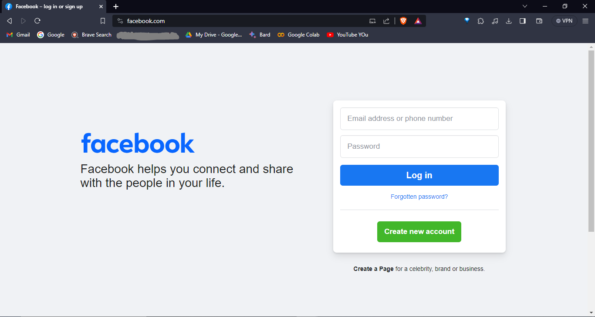

# facebook_clone
Hello everyone, here i tried to make a exact clone of facebook landing page using html and tailwind css.
learned how can i efficiently use this framework to design websites in less time using tailwind css framework. 
it's fast and clean and efficient. 

<h3>Real Landing Page </h3>

